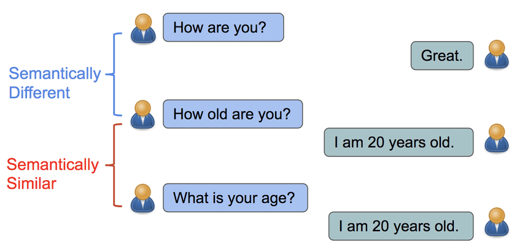

# Big Contexts and Effective Chunking: Maintaining Semantic Coherence in Text Processing

A way to circumvent the issue (think of it also as *token limit*) of a text being too big to be ingested by the language model (LLM) is through a process called 'chunking' or '**disassembling and reassembling.**'

But this process needs to **make sense**. We don't just split the text randomly (eventhough this could make sens for some cases).  
We want the chunks need to be sementically related. 

### What does 'semantically related' mean?

 It means that we don't want to simply divide the text into different parts; rather, we want to split it in a way that maintains the discursive logic and ensures that the different chunks are connected in terms of meaning."

Image reference: https://www.researchgate.net/figure/Sentences-are-semantically-similar-if-they-can-be-answered-by-the-same-responses_fig1_324690566

### LangChain text splitters

Before going further in into the topic of chunking we need a primer to the process of embeddings

## Embeddings

> An embedding, in the context of natural language processing (NLP), refers to a numerical representation of words or texts in a vector space*. It is a way to convert words or phrases into continuous numerical vectors, where similar words or phrases are represented by vectors that are close to each other in the vector space.

> The term "embedding" comes from the idea of "embedding" words or texts into a high-dimensional vector space, where each dimension of the vector represents a different aspect or feature of the word or text. By placing words or texts in this vector space, their relationships and similarities can be captured and used for various NLP tasks such as text classification, information retrieval, and machine translation.

*Embedding in vector space refers to the process of representing data points as vectors in a high-dimensional space, where each dimension corresponds to a feature or attribute of the data. 

### Embeddings illustration

Image reference: https://medium.com/@hari4om/word-embedding-d816f643140

### Vector-based Semantic Matching for Question-Text Retrieval

- Create Vector space from the text
- Create a query vector

If we want to ask a question about a large text, we can treat the question itself as a query. We then convert the query into a vector representation, which allows us to place it within a vector space where all the embeddings of the chunks of the large text reside. By calculating the similarity between the query vector and the other vectors in the space, we can identify the closest vectors, which correspond to chunks of the text that are semantically similar to our query.

References: 
- https://towardsdatascience.com/neural-network-embeddings-explained-4d028e6f0526
- https://developers.google.com/machine-learning/crash-course/embeddings/video-lecture

## LangChain's VectorDBQA: Question Answering using Vector Database and Language Model

VectorDBQA chain is a system designed for question answering using a vector database. It follows the following steps:

1. Retrieving relevant documents from the vector database based on the input query.
2. Obtaining the vectors representing these documents.
3. Converting the vectors into text representations or chunks.
4. Constructing a prompt using the text/chunks and sending it to the Language Model (LLM).
5. Utilizing the LLM to generate an answer based on the constructed prompt.

### Pinecone

Pinecone is an advanced vector database and vector similarity search service provided by OpenAI.It is designed to handle high-dimensional vector data efficiently and provide fast and accurate similarity search capabilities. Pinecone allows users to store and retrieve vectors based on their similarity, making it useful for various applications such as recommendation systems, natural language processing, image search, and more.

